# C4 Nivel 2 — Diagrama de contenedores

Equipo ACC — Soporte Técnico ISP. Refleja el estado real del sistema en la Entrega 4: dos
clientes (web + móvil nativo) detrás de un único API Gateway, siete microservicios (incluido
`telemetry-service` de PE-U1), cluster CockroachDB de 3 nodos, Kafka + MongoDB para la saga por
coreografía, y la pila de observabilidad completa. Este archivo renderiza el diagrama
directamente en GitHub (bloque Mermaid) — para incluirlo en el documento LaTeX, exportar como PNG
desde [mermaid.live](https://mermaid.live) pegando el bloque de abajo.

**Actualizado respecto al diagrama de la Entrega 3**: se retira el `frontend` HTML/CSS/JS
vanilla (reemplazado por `apps/web`), se agrega el `api-gateway` como único punto de entrada
(antes los clientes llamaban a cada microservicio directo), se agregan `apps/mobile` y
`telemetry-service`, y se agrega la pila de observabilidad como grupo de contenedores.

**Nota de vigencia (revisión propia posterior)**: el `.png` incrustado en el manuscrito
(`c4-nivel2-contenedores.png`) se exportó antes de esta corrección y todavía muestra "Scrape de
/actuator/prometheus x6" (el conteo real, verificado contra `ops/prometheus/prometheus.yml`, es
**4**: auth, ticket, report y api-gateway — `telemetry-service` expone el endpoint pero nadie lo
scrapea todavía) y le faltan las relaciones `api-gateway → otel-collector` y
`telemetry-service → otel-collector` (las cinco instancias Java sí exportan trazas por OTLP,
verificado en los cinco `Dockerfile` y en `docker-compose.yml`). El bloque Mermaid de abajo ya
tiene las tres correcciones; `mermaid-cli` (`npx @mermaid-js/mermaid-cli`) está disponible en esta
máquina pero su capa de auto-layout produce texto superpuesto e ilegible en este diagrama en
concreto (probado con varias configuraciones) — hace falta re-exportar a mano desde
[mermaid.live](https://mermaid.live), que sí lo distribuye legible, y reemplazar el PNG del
manuscrito antes de que esta corrección sea visible en el PDF.

```mermaid
C4Container
    title Sistema de Soporte Técnico ISP — equipo ACC (Nivel 2: Contenedores, Entrega 4)

    Person(cliente, "Cliente", "Abonado del ISP que reporta incidencias")
    Person(tecnico, "Técnico", "Resuelve tickets de su zona, cierra en sitio")
    Person(admin, "Administrador", "Gestiona cuentas y ve reportes")

    System_Boundary(sistema, "Sistema de Soporte Técnico ISP") {
        Container(web, "apps/web", "React 18 + TypeScript, Nginx", "Consola de operadores/clientes (SPA)")
        Container(mobile, "apps/mobile", "Kotlin + Jetpack Compose", "Cliente de campo del técnico (GPS + cámara)")

        Container(gateway, "api-gateway", "Spring Cloud Gateway", "Único punto de entrada, enrutamiento por prefijo")

        Container(auth, "auth-service", "Java 21 + Spring Boot", "JWT, RBAC, refresh tokens, métrica de sesiones activas")
        Container(ticket, "ticket-service", "Java 21 + Spring Boot, 4 capas", "CRUD de tickets, 6 patrones GoF, correlación en Incidencias (CORREL)")
        Container(notif, "notification-service", "Node.js + Express", "Notificaciones multicanal (simuladas)")
        Container(ai, "ai-service", "Python + FastAPI", "Clasificación asíncrona por reglas")
        Container(report, "report-service", "Java 21 + Spring Boot", "Modelo de lectura CQRS, reportes, export CSV")
        Container(telemetry, "telemetry-service", "Java 21, sockets TCP + gRPC", "Canal de telemetría PE-U1: equipos del abonado + latidos de nodo, reloj de Lamport")

        ContainerDb(crdb, "CockroachDB", "Cluster 3 nodos", "auth_db / ticket_db (+ incidencias) / report_db — PARTITION BY RANGE(created_at)")
        ContainerDb(mongo, "MongoDB", "Documento", "ai_db / notifications_db")
        ContainerQueue(kafka, "Kafka", "Message broker", "ticket.created / ticket.classified / ticket.status-changed / ticket.assigned / ticket.escalated")

        Container_Boundary(obs, "Observabilidad") {
            Container(otel, "otel-collector", "OpenTelemetry Collector", "Agregador de métricas/logs/trazas")
            Container(prom, "Prometheus", "TSDB", "Scrape de /actuator/prometheus x4 (auth, ticket, report, api-gateway)")
            Container(tempo, "Tempo", "Backend de trazas", "Trazas distribuidas por trace_id")
            Container(grafana, "Grafana", "Dashboard", "6 vistas: peticiones, p50/p95/p99, 5xx, Raft, contenedores")
        }
    }

    Rel(cliente, web, "Usa", "HTTPS")
    Rel(admin, web, "Usa", "HTTPS")
    Rel(tecnico, mobile, "Usa", "HTTPS")

    Rel(web, gateway, "Toda la API", "REST/JSON + JWT")
    Rel(mobile, gateway, "Toda la API", "REST/JSON + JWT")

    Rel(gateway, auth, "Enruta /api/v1/auth", "REST/JSON")
    Rel(gateway, ticket, "Enruta /api/v1/tickets", "REST/JSON")
    Rel(gateway, report, "Enruta /api/v1/reports", "REST/JSON")

    Rel(ticket, auth, "Valida token", "REST/JSON")
    Rel(report, auth, "Valida token (solo ADMIN)", "REST/JSON")
    Rel(ticket, telemetry, "Consulta evidencia de avería (modo c2)", "gRPC")

    Rel(auth, crdb, "Lee/escribe", "JDBC")
    Rel(ticket, crdb, "Lee/escribe", "JDBC")
    Rel(report, crdb, "Lee/escribe", "JDBC")

    Rel(ticket, kafka, "Publica eventos del ciclo de vida", "JSON")
    Rel(ai, kafka, "Consume ticket.created, publica ticket.classified", "JSON")
    Rel(notif, kafka, "Consume los eventos", "JSON")
    Rel(report, kafka, "Consume los eventos (modelo CQRS)", "JSON")

    Rel(ai, mongo, "Guarda clasificaciones", "ai_db")
    Rel(notif, mongo, "Guarda notificaciones simuladas", "notifications_db")

    Rel(auth, otel, "Exporta trazas", "OTLP")
    Rel(ticket, otel, "Exporta trazas", "OTLP")
    Rel(report, otel, "Exporta trazas", "OTLP")
    Rel(gateway, otel, "Exporta trazas", "OTLP")
    Rel(telemetry, otel, "Exporta trazas", "OTLP")
    Rel(otel, prom, "Métricas propias del collector (no las de aplicación: cada servicio Java expone las suyas por scrape directo, arriba)", "remote_write")
    Rel(otel, tempo, "Trazas", "OTLP")
    Rel(grafana, prom, "Consulta PromQL", "HTTP")
    Rel(grafana, tempo, "Consulta trazas", "HTTP")
```

