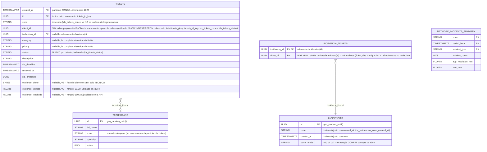

# Esquema de `ticket_db` (CockroachDB, cluster de 3 nodos)

Corresponde a las migraciones Flyway `services/svc-principal/src/main/resources/db/migration/V1__init_ticket_schema.sql`
(las cinco tablas, Entregable 5 de la guía de cierre) y `V3__add_close_evidence.sql` (las tres
columnas de evidencia de `tickets`, Entregable 10 — `V2__configure_ticket_zone.sql` no cambia
columnas, solo la política de replicación, ver la sección "Diseño del esquema y fragmentación"
del manuscrito, `docs/latex/secciones/diseno_esquema.tex`). `tickets` es la tabla de mayor
cardinalidad y la única fragmentada (`PARTITION BY RANGE
(created_at)`, ver [ADR-0003](../adr/0003-sharding-policy.md)); `technicians`, `incidencias` e
`incidencia_tickets` son dimensiones pequeñas sin particionar.

`incidencia_tickets.ticket_id` no lleva una restricción `REFERENCES tickets(id)` real en
`V1__init_ticket_schema.sql` —se deja como `UUID NOT NULL` simple, dentro de la misma base
`ticket_db` que `tickets` (verificado: `SHOW TABLES` lista ambas)—, así que el diagrama no dibuja
esa relación como una FK aplicada por la base; la integridad la mantiene la lógica de
`CorrelationService` (Sección de Arquitectura), no una restricción de esquema.

## Notas de diseño

- **Colocalización con `clientes`**: la guía de la Entrega 3 pide colocalizar `tickets` con
  `clientes` por `client_id`. Los clientes viven en `auth_db.users`, propiedad de `auth-service`
  — una base de datos física distinta, por diseño de microservicios (cada servicio es dueño de su
  propio esquema). Ver la sección correspondiente del ADR-0003 para la discusión completa de este
  trade-off.
- **`network_incidents_summary`**: tabla de respaldo para materializar el resultado del pipeline
  de Spark (ver `spark/README.md`, sección de integración) — no se llena desde `ticket-service`,
  la llena un job de Spark o un script de materialización aparte.
- El esquema completo de los otros 4 microservicios (`auth_db`, `report_db`, `ai_db`,
  `notifications_db`) vive en sus propias migraciones Flyway:
  `services/auth-service/src/main/resources/db/migration/V1__init_auth_schema.sql`,
  `services/report-service/src/main/resources/db/migration/V1__init_report_schema.sql`, y las
  colecciones de MongoDB documentadas en los READMEs de `ai-service`/`notification-service`
  respectivamente.
