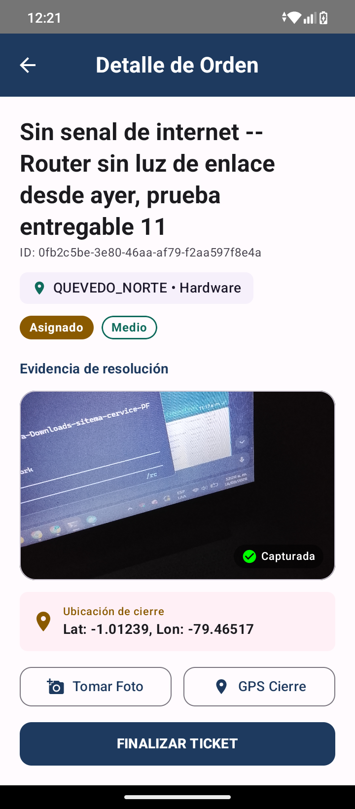
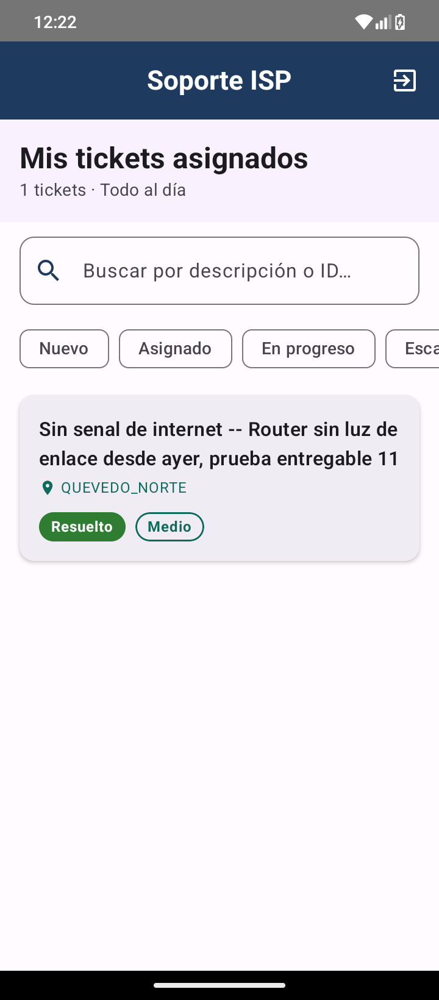

# Entregable 11 — Integración web + móvil + backend

Fecha: 2026-09-16. Ejecutado contra el *stack* completo de Docker Compose corriendo en local
(CockroachDB 3 nodos, Kafka, MongoDB, `auth-service`, `ticket-service`, `api-gateway`, etc.), con
el APK de depuración instalado en un dispositivo Android físico (`25028RN03L`) conectado por USB
(`adb reverse tcp:8000 tcp:8000`), no en un emulador.

Responde directamente a lo que pedía la guía de cierre para este entregable: *"Levantar el
sistema, ejecutar una acción desde el móvil con red, y versionar una evidencia fechada que
empareje la captura de la aplicación con la línea correspondiente del registro del servicio."*

## Qué se hizo

1. Se creó una cuenta técnico (`tecnico1@test.com`, zona `QUEVEDO_NORTE`) y una cuenta cliente
   (`cliente1@test.com`) vía `POST /api/v1/auth/admin/users`.
2. Se creó un ticket real como cliente (`POST /api/v1/tickets`, id
   `0fb2c5be-3e80-46aa-af79-f2aa597f8e4a`) y se asignó al técnico (`POST /{id}/assign`).
3. En el dispositivo físico, con la app instalada y el túnel `adb reverse` activo, se inició
   sesión como `tecnico1@test.com`, se abrió el ticket, se tomó una foto real con la cámara del
   dispositivo (permiso de cámara concedido en vivo) y se capturó la ubicación GPS real del
   dispositivo (`-1.0123905, -79.4651736`), y se tocó "Finalizar Ticket" — que envía
   `PATCH /{id}/status` con `status=RESUELTO`, la foto en Base64 y las coordenadas.
4. Se verificó el resultado por dos vías independientes del lado del backend: los logs de
   Hibernate del contenedor `ticket-service` (la sentencia `UPDATE` real ejecutada) y una consulta
   SQL directa a CockroachDB contra la tabla `tickets`.

## Captura de la app (móvil)



La app, justo antes de tocar "Finalizar Ticket", mostrando la foto capturada con la cámara del
dispositivo y "Ubicación de cierre — Lat: -1.01239, Lon: -79.46517".



Inmediatamente después de confirmar, la lista de "Mis tickets asignados" muestra el ticket con
estado **Resuelto**.

## Línea correspondiente del registro del servicio (backend)

Log real de `ticket-service` (Hibernate SQL), extraído con `docker logs ticket-service`,
timestamp `2026-09-16T05:22:23.962306296Z` — a menos de un segundo del `resolvedAt` que el propio
backend le asignó al ticket (`2026-09-16 05:22:23.950271+00`):

```json
{"@timestamp":"2026-09-16T05:22:23.962306296Z","@version":"1","message":"\n    update\n        tickets \n    set\n        category=?,\n        client_id=?,\n        description=?,\n        evidence_latitude=?,\n        evidence_longitude=?,\n        evidence_photo=?,\n        priority=?,\n        resolved_at=?,\n        sla_breached=?,\n        sla_deadline=?,\n        status=?,\n        technician_id=?,\n        zone=? \n    where\n        created_at=? \n        and id=?","logger_name":"org.hibernate.SQL","thread_name":"http-nio-8002-exec-8","level":"DEBUG","level_value":10000,"trace_id":"ae0c1200be6d5a797c2ca0cf0765ceda","span_id":"24c5f09f3558b39f","service":"ticket-service"}
```

Confirmado además con una consulta directa a la base de datos (`ticket_db.tickets` en
CockroachDB), que muestra la foto realmente persistida (no un valor vacío ni un *stub*: 2 417 037
bytes) y las mismas coordenadas GPS que se vieron en la pantalla del dispositivo:

```
id                                    status     resolved_at                  evidence_latitude  evidence_longitude  photo_bytes
0fb2c5be-3e80-46aa-af79-f2aa597f8e4a  RESUELTO   2026-09-16 05:22:23.950271+00  -1.0123905         -79.4651736          2417037
```

El log crudo completo y la salida completa de la consulta SQL quedan versionados sin editar en
[`entregable11_backend_log_raw_20260916.txt`](entregable11_backend_log_raw_20260916.txt).

## Por qué esto cumple lo pedido

- **Acción real desde el móvil con red**: no es un mock ni una llamada `curl` simulando al móvil —
  la foto y las coordenadas GPS se capturaron con el hardware real del dispositivo Android físico,
  a través de la UI de la app, con los permisos de Android concedidos en vivo durante la sesión.
- **Evidencia fechada**: todos los timestamps (captura de pantalla, log de Hibernate, `resolved_at`
  en la base de datos) caen en la misma ventana de segundos del 2026-09-16 ~05:22 UTC.
- **Empareja la captura de la app con la línea del registro del servicio**: el `trace_id`
  (`ae0c1200be6d5a797c2ca0cf0765ceda`) y el timestamp del log identifican exactamente la petición
  HTTP que originó la captura de pantalla "Resuelto" mostrada arriba, y la fila de la base de datos
  confirma que el efecto (foto + GPS persistidos) realmente ocurrió, no solo que el móvil lo
  intentó.
